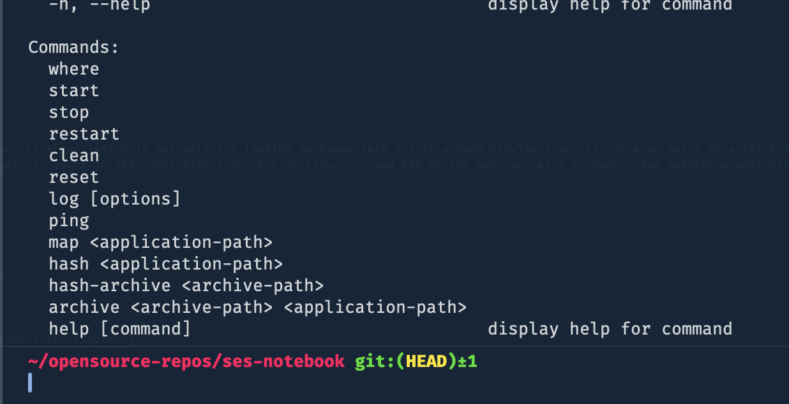

## SES Notebook

A place for compiling all of information related to the use of SES.

# endojs

## SES error codes

- [error-codes](./error-codes/)

## `@endo/compaterment-mapper`

# how to run 3rd party javascript in a Compartment in the browser

- [issue link](https://github.com/endojs/endo/issues/1411)

> To load ESM, you’ll need @endo/compartment-mapper. In its current form, it provides importLocation, which is suitable for loading packages laid out in a node_modules tree. It can also build an archive in zip format and read it out later, with makeArchive and importArchive. This may be enough to get you going in the right direction, but to securely load ESM on the web, you will probably need something analogous but not the same.

- [@kriskowal](https://github.com/kriskowal)

### Setting up 3rd party js

- The test case below demonstrates how 3rd party packages can get set up to work with endo.

- includes noble-hashes, vue, websocket.io

[test-infer-exports.js](https://github.com/endojs/endo/packages/compartment-mapper/test/test-infer-exports.j)

## @endojs/daemon

- cli for building the endo env (?)
- can be used to make archives of libraries

## Powers
